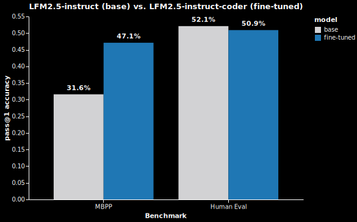

# LFM Coder
Fine-tune an LLM to enhance its coding capabilities using **Reinforcement Learning from Verifiable Rewards** (RLVR) with **Group Relative Policy Optimization** (GRPO).

Includes a **blazing-fast Python sandbox** for safely running model-generated code.

# Results

A model trained from this repository using only 1,000 examples from the [OpenCoder dataset](https://huggingface.co/datasets/OpenCoder-LLM/opc-sft-stage2) achieved a **49.1% improvement** in coding performance on the [MBPP benchmark](https://github.com/google-research/google-research/tree/master/mbpp) while maintaining general capabilities:

[][benchmark-plot]

_Try out the [trained model](https://huggingface.co/rparkr/LFM2.5-1.2B-Instruct-Coding), explore the [metrics during training](https://huggingface.co/spaces/rparkr/lfm-coder-training), or analyze the [training artifacts](https://huggingface.co/buckets/rparkr/lfm-coder-training-bucket/tree/README.md) for a deep look into the training process._

# Getting started

This repository can be used to:
1. train your own LLM for coding tasks using GRPO with RLVR
2. incorporate the extremely fast Python sandbox into your own projects

## Train your own model

> ![NOTE]
> **Hardware Requirements**: The default configuration is optimized for a single GPU with 8GB VRAM (e.g., NVIDIA RTX 4060 laptop). It uses 4-bit QLoRA and Liger kernels to minimize memory usage and maximize batch sizes.

1. **Clone this repository:**
   ```bash
   git clone https://github.com/rparkr/lfm-coder.git && cd lfm-coder
   ```

2. **Update the [`training_config.toml`](./training_config.toml):**
   - `model_id`: the Hugging Face model ID of the base model you want to fine-tune
   - `output_dir`: the Hugging Face repository where you want to upload the fine-tuned model
   - `trackio_space_id`: the Hugging Face Spaces project ID for live monitoring of training metrics and model performance

3. **Set your Hugging Face token** as an environment variable:
   ```bash
   export HF_TOKEN="your-hf-token"
   ```

4. **Run the training script**:

   Install [uv](https://github.com/astral-sh/uv#installation) if you don't have it already:
   ```bash
   curl -LsSf https://astral.sh/uv/install.sh | sh
   ```

   Then run the training script:
   ```bash
   uv run lfm-coder
   ```

   Or test with a dry run first to check the configuration:
   ```bash
   uv run lfm-coder --dry-run
   ```

## Use the Python sandbox in your own projects

**Features**

- 🚀 **Blazing fast:** execution times typically **under 1ms** thanks to [Pydantic-Monty](https://github.com/pydantic/monty/tree/main)
- 🛡️ **Robust:** automatic fallback to a lightweight container-based sandbox (178MB [image](./src/lfm_coder/sandbox/Dockerfile.sandbox)) supporting network access and third-party packages
- ⚡ **Parallel execution:** run multiple code blocks **concurrently** across isolated sandboxes
- 📦 **Built-in package management:** automatic installation (and caching) of third-party packages imported by the sandboxed code
- 📁 **Virtual file system:** optionally provide the sandbox with read-only access to local files
- 🔒 **Configurable resource limits** for CPU, memory, and network access
- ↔️ **Sync or async:** supports both synchronous and asynchronous code from the same API
- 🛠 **Multiple container engines:** [Podman](https://podman.io/) (recommended) or [Docker](https://docs.docker.com/engine/)

**Usage**

Install the package:
```bash
uv add lfm-coder
# or
pip install lfm-coder
```

Use the `Sandbox` class to run LLM-written Python code:

```python
from pprint import pprint

from lfm_coder.sandbox import Sandbox

sandbox = Sandbox()

# Single execution
result = sandbox.run("print('Hello World')")

# The result object includes stdout, stderr, return value, execution time, etc.
pprint(result)
```

```python
# Batch execution (parallel)
results = sandbox.run(["1+1", "2+2", "3+3"])
for r in results:
    print(r.stdout)
```

**Automatic fallback to Docker sandbox**

By default, the `Sandbox` class runs code in the fast [`Pydantic-Monty`](https://github.com/pydantic/monty/tree/main) sandbox and automatically falls back to the Docker sandbox when needed.

> [!NOTE]
> The Docker sandbox requires either [Docker](https://docs.docker.com/engine/) or [Podman](https://podman.io/) (_recommend_) to be installed and running.

```python
sandbox = Sandbox(
    # Allow network access for downloading packages and fetching data from
    # the web.
    disable_network=False,
    # Cache package downloads locally to speed up subsequent sandbox
    # execution with the same package dependencies.
    use_cache=True,
)

code_blocks = [
    # Standard Python code without external packages.
    # Runs in the blazing-fast sandbox (Pydantic-Monty)
    """
import math

def get_circle_info(r: float) -> dict:
    return {
        "radius": r,
        "area": math.pi * r ** 2,
        "circumference": 2 * math.pi * r,
    }

# Direct printing
print(get_circle_info(3.0))

# Last expression is automatically returned (in Monty only)
get_circle_info(4.0)
""",
    # Third-party packages (e.g., `tqdm`); runs in the Docker sandbox
    # with dependencies automatically installed and cached.
    """
import asyncio
import time

from tqdm.asyncio import tqdm

async def show_progress(num_iterations: int) -> float:
    '''Show progress of a loop and return the execution time.'''
    start_time = time.perf_counter()
    tasks = [asyncio.sleep(0.5) for _ in range(num_iterations)]
    result = await tqdm.gather(*tasks)
    duration = time.perf_counter() - start_time 
    return duration

execution_time = asyncio.run(show_progress(100))

print(f'{execution_time = :.1f}s')
""",
    # Network requests; runs in Docker sandbox.
    """
import httpx
from markdownify import markdownify as md

r = httpx.get('https://example.com')
markdown_text = md(r.text, heading_style='ATX')
print(markdown_text)
""",
]

# Execute all code blocks concurrently
results = sandbox.run(code_blocks)
pprint(results)
```

For other uses like file mounting and setting environment variables, run `help(Sandbox.run)` in a Python interpreter or see the `run` method in [`src/lfm_coder/sandbox/sandbox.py`](./src/lfm_coder/sandbox/sandbox.py).

# Motivation

Small language models (SLMs) are the key to fast, local coding agents, but they often struggle with complex programming tasks. Liquid AI's [LFM2.5-1.2B-Instruct](https://docs.liquid.ai/lfm/models/lfm25-1.2b-instruct) is exceptionally fast and efficient, but not optimized for coding out of the box.

This project uses **Reinforcement Learning from Verifiable Rewards (RLVR)** to bridge that gap. By training lightweight **LoRA adapters** (~22M parameters) with Hugging Face [**TRL**](https://github.com/huggingface/trl), we provide the model with a high-fidelity execution environment to learn from real-time, verifiable feedback. This approach significantly enhances coding performance while maintaining the model's tiny footprint and general capabilities.

# Key Innovations & Optimizations

This repository goes beyond basic fine-tuning by implementing a production-grade RLVR environment and training pipeline with the following optimizations:

### 🚀 High-Performance Sandbox
- **Dual-Engine Architecture**: Seamlessly alternates between a blazing-fast Rust-based Python interpreter ([Monty](https://github.com/pydantic/monty/)) and full-featured Docker/Podman containers.
- **Massive Concurrency**: Threaded execution across all CPU cores for both engines, enabling high-throughput reward computation essential for GRPO.
- **Smart Dependency Management**: Packages are installed dynamically based on code requirements while the base image remains lightweight (~180MB). Local caching ensures subsequent executions with the same dependencies load instantaneously and can run without network access.
- **Enterprise-Grade Isolation**: Configurable resource guards (CPU/memory limits), execution timeouts, and network isolation to ensure secure and stable execution of model-generated code.

### ⚡ Training & Evaluation Efficiency
- **Asynchronous Pipelining**: Overlaps GPU completion generation with CPU-based code verification to maximize hardware utilization and minimize idle time.
- **Optimized RLVR Pipeline**: Leverages QLoRA (4-bit) and Liger kernels to enable advanced GRPO training on consumer hardware (8GB VRAM).
- **Fault-Tolerant Workflows**: Robust state management with automatic resumption for both training and evaluation cycles.

### 📊 Data Quality & Integrity
- **Benchmark Sanitization**: Identifies and repairs incorrect test cases in standard benchmarks (HumanEvalPlus/MBPPPlus) to ensure rigorous evaluation.
- **Automated Validation**: Verifies all training examples against provided solutions to guarantee data quality before RLVR begins.
- **Granular Metrics**: Heuristic-driven extraction that calculates per-test-case pass rates and provides detailed execution logs for model weakness analysis.

### 🛠️ Engineering Excellence
- **Spec-Driven Design**: Built using the [OpenSpec](https://openspec.dev/) framework with a comprehensive test suite ensuring reliability in core execution and reward logic.
- **Extensible Architecture**: Clean, documented codebase designed for easy adaptation to new models, datasets, or custom reward functions.


# Project status

- [x] **Coding Sandboxes**: `MontySandbox`, `DockerSandbox`, and auto-routing `Sandbox` wrapper
- [x] **Training Dataset Processing**: Sampling, augmenting instructions, formatting in messages format, verifying correctness
- [x] **Evaluation Dataset Processing**: Processing and verification of evaluation data
- [x] **Reward Helper Functions**: Helper functions for RLVR reward computation
- [x] **Test Suite**: Coverage of sandbox methods and reward utilities (in the [tests](./tests/) directory)
- [x] **Evaluation Module**: Write evaluation module for scoring the model on the evaluation dataset (benchmarks)
- [x] **Baseline Performance**: Establish the model's baseline performance on the evaluation sets
- [x] **Training Module**: GRPO training with TRL, verifiable rewards, and 8GB VRAM optimization
- [x] **Config File**: TOML configuration for training, LoRA, and sandbox parameters
- [x] **Experiment Tracking**: Integration with `trackio` for HF Space logging
- [x] **Run Training**: Execute a full training run
- [x] **Publish Results**: Document and publish training results
- [ ] **Fix chat template on the [GGUF model](https://huggingface.co/rparkr/LFM2.5-1.2B-Instruct-Coding-merged-Q4_K_M-GGUF) to enable multi-turn chat**

## Training Stats

- **Base Model:** [LiquidAI/LFM2.5-1.2B-Instruct](https://huggingface.co/LiquidAI/LFM2.5-1.2B-Instruct)
- **Fine-tuned model:** [rparkr/LFM2.5-1.2B-Instruct-Coding](https://huggingface.co/rparkr/LFM2.5-1.2B-Instruct-Coding)
- **Hardware:** 1x NVIDIA GeForce RTX 4060 laptop GPU with 8GB VRAM
- **Training dataset:** [OpenCoder-LLM/opc-sft-stage2](https://huggingface.co/datasets/OpenCoder-LLM/opc-sft-stage2) (1,000 examples; 3 epochs with gradient accumulation)
- **Evaluation datasets:** [evalplus/humanevalplus](https://huggingface.co/datasets/evalplus/humanevalplus) (163 examples) + [evalplus/mbppplus](https://huggingface.co/datasets/evalplus/mbppplus) (374 examples)
- **Training duration:** 65.1 hours (2 days 17.1 hours)
- **Evaluation duration:** 13.8 hours (evals were performed every 1,000 steps during training)
- **Total training duration:** 78.9 hours (3 days 6.9 hours)
- **Sandbox executions during training:** 24,000 (3,000 steps of training each with a batch size of 8)
   - **Monty sandbox:**
      - 18,556 executions (77.3%)
      - 69.8% successful execution (i.e., no syntax or runtime errors); falling back to Docker when unsuccessful (e.g., when a third-party library was used)
      - Avg. execution time: 0.00101s
      - Median execution time: 0.0004s
      - _2,000-5,000x faster than the Docker sandbox_
   - **Docker sandbox:**
      - 5,444 executions (22.7%)
      - 35.8% successful execution
      - Avg. execution time: 2.5773s
      - Median execution time: 2.2403s


# Acknowledgments

- [pydantic-monty](https://github.com/pydantic/monty/) for the lightning-fast Python sandbox used for calculating rewards during RLVR training
- Hugging Face for the [TRL](https://github.com/huggingface/trl) library used for reinforcement learning with GRPO and [trackio](https://github.com/gradio-app/trackio) for automated metric tracking and visualization
- [Evalplus](https://huggingface.co/datasets/evalplus) for the benchmark datasets
    - [evalplus/humanevalplus](https://huggingface.co/datasets/evalplus/humanevalplus): Enhanced HumanEval benchmark from OpenAI with more test cases
    - [evalplus/mbppplus](https://huggingface.co/datasets/evalplus/mbppplus/): enhanced version of the Mostly Basic Python Programs benchmark from Google with more test cases
- [OpenCoder-LLM](https://huggingface.co/datasets/OpenCoder-LLM/opc-sft-stage2) for the training data
- [Liquid AI](https://docs.liquid.ai/lfm/getting-started/welcome) for the open-weight [LFM2.5-1.2B-Instruct](https://huggingface.co/LiquidAI/LFM2.5-1.2B-Instruct) model used as the base model for this project
- The [Liquid AI Cookbook on GRPO fine-tuning](https://github.com/Liquid4All/cookbook/blob/main/finetuning/notebooks/grpo_for_verifiable_tasks.ipynb) for an example GRPO configuration   
- [OpenSpec](https://openspec.dev/) framework for spec-driven development with coding agents
- Google for the [Antigravity IDE](https://antigravity.google/) and [Gemini](https://deepmind.google/models/gemini/) models used for implementing some of the features

# License

The code in this repository is distributed under the [MIT license](./LICENSE).

The [model weights ](https://huggingface.co/rparkr/LFM2.5-1.2B-Instruct-Coding) from the LFM2.5-1.2B model inherit the base model's [`lfm` license](https://huggingface.co/LiquidAI/LFM2.5-1.2B-Instruct/blob/main/LICENSE), which is like Apache 2.0, with a restriction on commercial use for organizations with over $10M in annual revenue.

<!-- Footnotes and links -->

[benchmark-plot]: https://vega.github.io/editor/#/url/vega-lite/N4IgJAzgxgFgpgWwIYgFwhgF0wBwqgegIDc4BzJAOjIEtMYBXAI0poHsDp5kTykBaADZ04JAGyUALJQCMlAFYQ2AOxAAaEEyRQA1mQBObBsoAmaTYO071IKCoBmNMmlBIAHjQguQBmmdT2SIIQcBqWTHCCAILKZIJwaAAMAL5h5HCm3uGRAMJsgmz65gDuMCI2mHTxeQVF6KXlqSCVmPHedrUlZZgJTcQ0cMXtKpXKDEYQABJwTlhoAMyJiRp2yqPjDBAA6n70C0sajoKC5kyWujYQmIY6Cahjx8lNJkiYKKigykgIdyAvb-x5pJ5mITKC4ABOSRwJAADjEUPscHsUFhSEScCg9nsEKQEKgAFYQM9XkgQpgvB8-qTAcDQeCoTD4Yjkaj0Zjsbj8UTUABtUARZSwZD6azoSYMZDKAAEAFFiEEbLAkLE7g9BBoEGwTJFTmSEhocGSIAABGRJSgEgBMMlSAoywqQovMEqlcoVJxWMBVZDu-ESlESVvmmu1uvQjmUcH4mGMcDMhuNZotBMSELtmgdMBFYpAAFkAEIABSLSu9qrQ6tDOpO6C0IRsRogpvNqAD8xkYgzgsdzvQhZLZZ9dwDkghMmr4ZAkejsajCZATZbFskAHZbQBdJrwWaYcyrN40KNFMJIACecDq-JADu1R+cVI6hW8jki-hAWprlygQTuoBMbDIEeaC8po+o2DOMZxmYG4aPow4gSAADEJhWqhJiSDYSEyPYq6rkwmFbhomBnjgvzKIBR6Kk0bBGlAdBnsMph0OwqhUka8EIOYHHfAA+rCTKwkwuJQFaUCrkgcAyEwNgegwdy2hockjpQ8xNJgbD5JUOAgaAr6CO+n66hm+nvj22ZOtYxFVL8BZZjmxJqHpAwGdxSbmochTIHu6BqKp9gVDZbnNma0raFADDwVAjEmS5hlhicsVvvu5a+hBXmvOYADUsgAKTErBIBuC+cWnPZlmXIUPl-HA0AZCY96Ba0tnlc6xGkeRlFfIlGhuAA8ti5Ilcl6BGZ6zQdeYFEIFRPUgIxVKmcFy7Wc1y2heFkXaIx7VkeYACODAqi0rw0KQxJNA5VIkXtdZOo5IBfD85j9IMvFwGIoIyMiTBiJI2g4b9vGJI5oC3g1sTDJ0VLKV0jQaLR2gMUxDWVCo3g8Vx6CY-xgnCdoYkSVJMlKUE8loIpICw22qnqXAbg+c5I2Lu56X6N55h5Q9GlaTQOl8kzrmjQloPTqVdatVZzRBegdlChZzpJULLMhR504ZdVfnzAFq1tNj7lhVAEVRTFTli8zY2i0t6DKhWnns5l6A5TI+XJIVxWLeLmbyw5GhKPo1U6nVzGQ7rLU+xVu2dTN3UPf1g1wIz5vK5bUdTV11EaAtgvvkuyZh+tMiG8b20VJN6CHcddCnedTyahVVL1pER6-EwbDYIBNgmAt-AEp5axbDMZBzHW+QLjdvw9AzF2FZjlLXkwR7vvEvqZBoT2-DjAlwkJImE5J0mXJEmJJ6Z88fiLhXo8LmxwGwpAnhNt2LmwR57n0AzFOfr3FO9n0mN9ewv1-pQEBmIYGIAtyFRaHrEAAAZAAYnmK0lp+BHiuPoBgUBMDSgABRNwAJTSmIBASg0pEHINQeg64WDMD8DsDqfQeDIJznjAQmwt92aJ3eGDBAEQTB9RwGjZQlJgB1xAMUXYMB9wjCQC3IoyQgA/view
